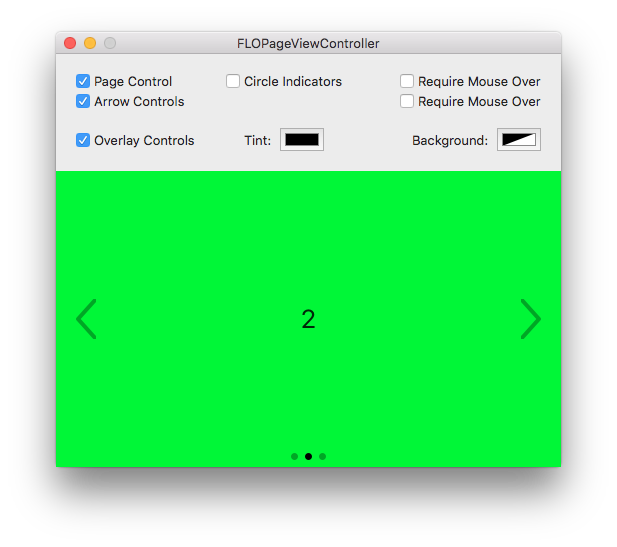

# FLOPageViewController
`FLOPageViewController` is an easy to use page view controller for macOS, similar to `UIPageViewController` for iOS. It uses `NSPageController` under the hood, but is much simpler to use and provides customizable UI elements for navigation.

## Usage
`FLOPageViewController` is a subclass of `NSViewController` and NOT `NSPageController`. Thus, you can use a `FLOPageViewController` as your window's content view controller.

Basically, you just need to pass an array of `NSViewController`s to your `FLOPageViewController` instance using the `viewControllers` property.
If you're working with storyboards,  you might want to use the `loadViewControllers(:from:)` convenience method. It will load `NSViewController`s from an `NSStoryboard` using the given `identifiers` array.

## Behavior + Appearance

#### Page Control
The `pageControl` is visible by default and supports two different styles, `.dot` and `.circle`. Set the `showPageControl` property to `false` in order to hide it. If you only want to show it when the mouse is inside, set the `pageControlRequiresMouseOver` property to `true`.

To change the size, override the default value of `indicatorSize` in `FLOPageControl.swift`.

#### Arrow Controls
The arrow controls are hidden by default. Set the `showArrowControls` property to `true` in order to show them. Arrows will be hidden automatically depending on if there is a previous/next page. If you only want to show them when the mouse is inside, set the `arrowControlsRequireMouseOver` property to `true`.

To change the size, change the `ArrowSize` constant in `FLOPageViewController.swift`. To change the thickness, override the default value of `lineWidth` in `FLOArrowControl`'s `draw(:)` method.

#### Overlay
By default, all controls will appear above the pages. You can change this behavior by setting the `overlayControls` property to `false`. If you do this, you may want to read the `pageSize` property to be able to size your pages appropriately.

#### Colors
The `tintColor` property controls the color of the page indicators and arrow controls. This color should have an alpha value of `1.0`.

The (optional) `backgroundColor` property is the color displayed behind the pages. By default, no color is being displayed.

#### Gestures
As `FLOPageViewController` uses `NSPageController` under the hood, swipe gestures are supported by default.

## Requirements + Compatibility
`FLOPageViewController` requires Swift 3.0. It is compatible with macOS 10.10 and later. I've tested it on 10.10, 10.11 and 10.12.

## Installation
Just add all files from the [`Source`](Source/) folder to your project and you're good to go.

## Localization
`FLOPageViewController` supports R-L languages out of the box. In case of an R-L language, the `viewControllers` array will be reversed and the `pageControl`'s `selectedPage`will be set to the last index.

## To Do
- [ ] Delegate callbacks
- [ ] Methods for navigation (with support for R-L languages)
- [ ] Property to set the initial selected page
- [ ] Support for varying page sizes
- [ ] Accessibility support
- [ ] UI tests
- [ ] Properties to change the appearance of the navigation controls

Feel free to create pull requests based on this list or suggest even more improvements.

## Contact
Florian Schliep

- [github.com/floschliep](https://github.com/floschliep)
- [twitter.com/floschliep](https://twitter.com/floschliep)
- [floschliep.com](http://floschliep.com)

## License
`FLOPageViewController` is available under the MIT license. See the LICENSE file for more info.
